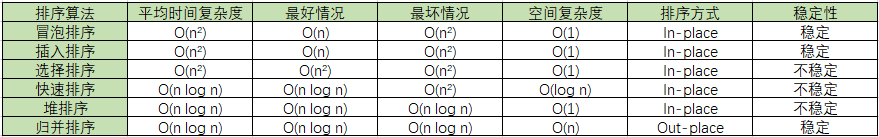

# 排序算法

排序算法是《数据结构与算法》中最基本的算法之一。

排序算法可以分为内部排序和外部排序，内部排序是数据记录在内存中进行排序，而外部排序是因排序的数据很大，一次不能容纳全部的排序记录，在排序过程中需要访问外存。

常见的内部排序算法有：冒泡排序、插入排序、选择排序、快速排序、堆排序、归并排序等。用一张图概括：

**关于时间复杂度**：

O(n²)：冒泡排序、插入排序、选择排序。

O(n log n)：快速排序、堆排序、归并排序。

**关于稳定性**：

稳定的排序算法：冒泡排序、插入排序、归并排序。

不是稳定的排序算法：选择排序、快速排序、堆排序。